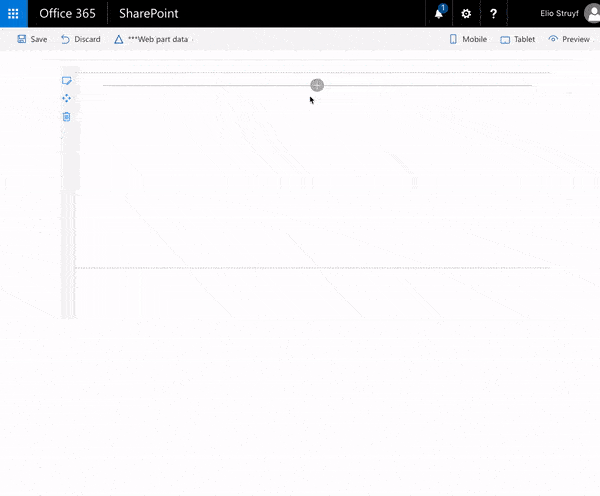
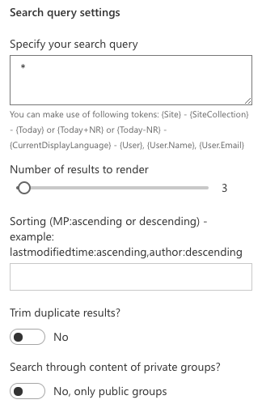
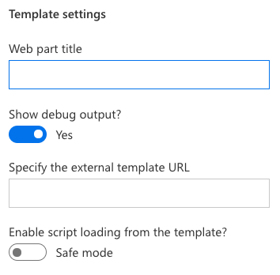
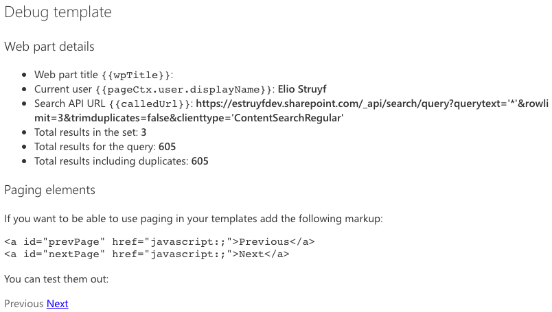
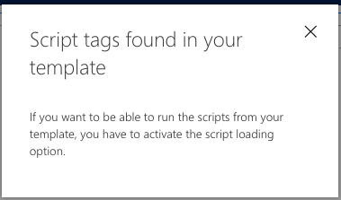
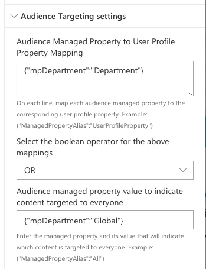

# Search Result Visualizer web part created with React and Handlebars templates

This web part is created to allow you to visualize search results by using custom Handlebars templates. Originally this web part made use of a React template system, but by switching the system to use Handlebars instead it became a lot easier to create custom templates.

> If you are interested in the original project, feel free to explore the code over here: [Search WP SPFx](https://github.com/estruyf/Search-WP-SPFx).

The idea of this web part is to mimic the functionality of the `Content Search Web Part` and its `display templates` approach.



> Credits to [Simon-Pierre Plante](https://github.com/spplante) for the idea to make use of Handebars templates and [Mikael Svenson](https://twitter.com/mikaelsvenson) for the code to allow to load external scripts in the templates. 

## Minimal Path to Awesome

- Clone this repository
- In your command prompt, run:
    - `npm install`
    - `gulp serve --nobrowser`
    - Open your hosted workbench and start exploring the web part

## Using the web part

### Search query settings



#### Queries

In the query field, you can enter your own queries like:
- `*`: to retrieve everything
- `fileextension:docx`

But you can also use search tokens like:
- `{Site}`
- `{SiteCollection}`
- `{Today}` or `{Today+Number}` or `{Today-Number}`
- `{CurrentDisplayLanguage}`
- `{User}`
- `{User.Name}`
- `{User.Email}`

#### Number of results

Specify the number of results you want to retrieve for the specified query.

> Maximum 50 results. This is a limit configured in the web part code and can be changed.

#### Sorting

Specify the managed property name and the sorting order (comma separated):
- Single: `lastmodifiedtime:ascending`
- Multiple: `lastmodifiedtime:ascending,author:descending`

#### Trim duplicate results

Specify if you want to trim duplicate results.

> By default this option is disabled.

### Search through data from private groups

Specify if you want to search through the data of private Office 365 Group sites.

> By default this option is disabled.

### Template settings

By default the web part shows the debug view of your query. This returns all the fields, values, and bindings of how to make use of it in your templates.



#### Web part title

This is a title which you can specify to be used in your custom template. The Handlebar binding to be used is `{{wpTitle}}`.

#### Show debug output

This setting is by default enabled. If you want to make use of your own template you have to disable it and specify a template URL.

#### External template URL

Specify an absolute URL to your HTML template file. In the templates folder you can find a sample template file: [test.html](./templates/test.html).

> The project also automatically includes the [handlebars-helpers](https://github.com/helpers/handlebars-helpers) library for you. This way you can achieve more in your templates.

Template can also have paging controls. You have to create two elements with the following IDs:
- `prevPage`
- `nextPage`

```html
<a id="prevPage" href="javascript:;">Previous</a>
<a id="nextPage" href="javascript:;">Next</a>
```

The web part will automatically do the event binding.



Template can also have localization system, see [test.html](./templates/test.html) for example (moment and key/value example).

##### SharePoint Helpers

There are a couple of custom SharePoint helpers available for you to make use of. The list of available SP helpers are:
- `siteCollectionUrl`: returns the URL of the current site collection
- `siteUrl`: returns the URL of the current site
- `splitDisplayNames`: (input => "user1;user2;user3") (common example is the author field)
- `splitSPUser`: (input => "email | displayname | .... i:0#.f|membership|username") (common example is the editor field)
- `splitSPTaxonomy`: (input => "GP0|#4586d598-0685-4fdc-bd99-b9eed3cea791;L0|#04586d598-0685-4fdc-bd99-b9eed3cea791|MyTerm;GTSet|#e961b817-850b-4898-9dd7-12409669d2fe")
- `splitSPUrl`: (input => "http://www.myurl.com,Description", "url || description")

They can be use in the template as follows:
```html
{{siteCollectionUrl}}
{{siteUrl}}
{{splitDisplayNames Author}}
{{splitSPUser EditorOWSUSER 'displayName'}}
{{splitSPTaxonomy owstaxIdmytaxonomy}}
{{splitSPUrl urlProp 'url'}}
```

#### Script loading

With this setting you can specify if you want to execute/load the script that are defined in your template. When you add a custom template, the web part will automatically check and warn you (only when you are configuring the web part).



> By default this setting is disabled.

### Audience targeting settings

Inside the audience targeting settings you can target content based on a users profile property.



#### Audience Managed Property to User Profile Property Mapping

In this setting you define which managed property and user profile property you want to bind. For example: `{"RefinableString00":"Department"}`. The web part will look into the user its profile properties, if it finds it, it will get added to the search call: `RefinableString00="IT"`.

> Multiple properties are possible, add each mapping on a separate line.

#### Select the boolean operator for the above mappings

Specifies the operator between the above settings. 

#### Audience managed property value to indicate content targeted to everyone

This can be used to include content audience targeting which should be visible for everyone.
